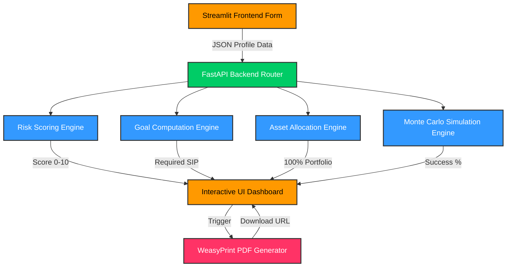

# AI-Powered Mutual Fund Advisory & Portfolio Intelligence System

An AI-based Goal-Oriented Financial Planning Engine.

## Features
- Calculates retirement corpus
- Calculates child education corpus
- Recommends SIP allocation
- Computes explainable risk score
- Generates interactive dashboard
- Produces downloadable PDF report
## Architecture Flow

## Tech Stack
- Backend: FastAPI
- Frontend: Streamlit
- Charts: Plotly
- Math & Data: NumPy, Pandas
- PDF Generation: WeasyPrint

## Disclaimer
Please see `DISCLAIMER.txt`.
