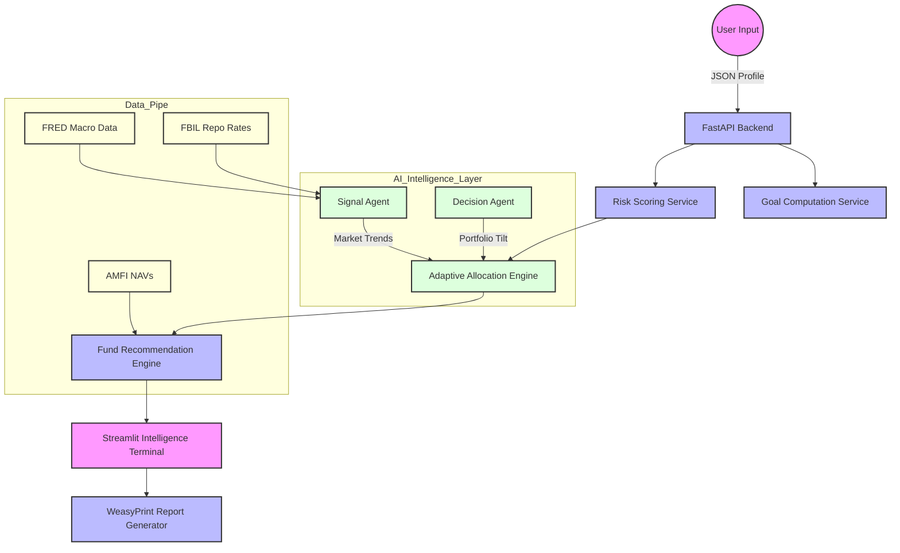
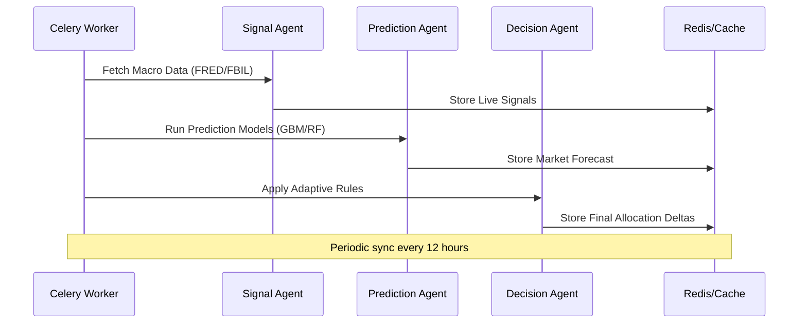

# AI-Powered Mutual Fund Advisory & Portfolio Intelligence System

An institutional-grade, AI-driven financial planning and portfolio intelligence engine. This system combines Modern Portfolio Theory (MPT), Monte Carlo simulations, and real-time macroeconomic signals to deliver personalized, goal-oriented investment strategies.

---

## 🚀 Vision
To democratize high-end financial advisory by providing a quant-native, transparent, and AI-orchestrated platform that handles everything from risk profiling to dynamic asset reallocation and automated fund selection.

## 🧠 Core Intelligence Modules

### 1. Risk Intelligence Engine (`risk_engine`)
- **Multi-Factor Profiling**: Analyzes age, dependents, behavioral traits, income, and savings capacity.
- **XAI (Explainable AI)**: Provides a granular breakdown of why a specific risk score (0-10) was assigned.
- **Dynamic Allocation Mapping**: Converts risk scores into baseline MPT-optimized asset weights.

### 2. Goal Optimization Engine (`goal_engine`)
- **Lifecycle Modeling**: Specialized calculators for Retirement, Child Education, Wealth Creation, and Emergency Funds.
- **Inflation-Adjusted Projections**: Uses real-time CPI data to ensure future purchasing power is maintained.
- **Step-up SIP Logic**: Recommends incremental investment increases to meet ambitious targets.

### 3. Portfolio Intelligence (`portfolio_engine`)
- **Health Diagnostics**: Detects "Cash Drag", over-concentration in FDs, and gold overallocation.
- **Diversification Scoring**: Quantifies how well a portfolio is spread across asset classes.
- **Gap Analysis**: Identifies mismatches between user risk profile and actual current holdings.

### 4. Adaptive Allocation Layer (`ai_layer`)
- **Macro-Aware Rebalancing**: Adjusts equity/debt/gold weights based on live signals (Inflation, Repo Rate, Bond Yields).
- **Rule-Based Deltas**: Uses a sophisticated rule engine (`allocation_rules.py`) to tilt the portfolio towards safety or growth.

### 5. Fund Recommendation Pipe (`recommendation_engine`)
- **Multi-Factor Scoring**: Ranks 2000+ mutual funds based on 1y/3y/5y returns, volatility, AUM, and Expense Ratio.
- **Dynamic Filtering**: Only suggests funds that match the target category and risk profile.

---

## 🏗 System Architecture

### High-Level System Flow

```mermaid
graph TD
    classDef user fill:#f9f,stroke:#333,stroke-width:2px
    classDef engine fill:#bbf,stroke:#333,stroke-width:2px
    classDef ai fill:#dfd,stroke:#333,stroke-width:2px
    classDef data fill:#ffd,stroke:#333,stroke-width:2px

    User((User Input)):::user --> |JSON Profile| API[FastAPI Backend]:::engine
    API --> RiskEngine[Risk Scoring Service]:::engine
    API --> GoalEngine[Goal Computation Service]:::engine
    
    subgraph AI_Intelligence_Layer
        SignalAgent[Signal Agent]:::ai --> |Market Trends| AdaptiveAlloc[Adaptive Allocation Engine]:::ai
        DecisionAgent[Decision Agent]:::ai --> |Portfolio Tilt| AdaptiveAlloc
    end

    RiskEngine --> AdaptiveAlloc
    AdaptiveAlloc --> RecoEngine[Fund Recommendation Engine]:::engine
    
    subgraph Data_Pipe
        AMFI[AMFI NAVs]:::data --> RecoEngine
        FRED[FRED Macro Data]:::data --> SignalAgent
        FBIL[FBIL Repo Rates]:::data --> SignalAgent
    end

    RecoEngine --> Dashboard[Streamlit Intelligence Terminal]:::user
    Dashboard --> PDF[WeasyPrint Report Generator]:::engine
```

### AI Agent Orchestration

```mermaid
sequenceDiagram
    participant W as Celery Worker
    participant S as Signal Agent
    participant P as Prediction Agent
    participant D as Decision Agent
    participant DB as Redis/Cache

    W ->> S: Fetch Macro Data (FRED/FBIL)
    S ->> DB: Store Live Signals
    W ->> P: Run Prediction Models (GBM/RF)
    P ->> DB: Store Market Forecast
    W ->> D: Apply Adaptive Rules
    D ->> DB: Store Final Allocation Deltas
    Note over W,DB: Periodic sync every 12 hours
```

---

## 📊 Mathematical Foundations
- **Modern Portfolio Theory (MPT)**: Initial asset allocation optimized for the efficient frontier based on user risk.
- **Monte Carlo Simulations**: Runs 1000+ iterations to determine the "Probability of Success" for financial goals.
- **Geometric Brownian Motion (GBM)**: Used by prediction agents to forecast potential market trajectories.
- **Inflation Indexing**: Continuous adjustment of goal targets using the latest CPI (YoY) data.

---

## 🛠 Tech Stack
- **Frontend**: Streamlit (Reactive UI), Plotly (Interactive Charts)
- **Backend**: FastAPI (Async API), Celery (Distributed Tasks)
- **Database/Cache**: Redis (Agent state), JSON/CSV (Local storage)
- **Data Science**: Pandas, NumPy, Scikit-learn, yfinance
- **Reporting**: WeasyPrint (HTML-to-PDF)

---

## ⚙️ Setup & Installation

### Prerequisites
- Python 3.10+
- Redis (for Celery workers)

### 1. Clone & Install
```bash
git clone <repo-url>
cd mutual-fund-advisory
python -m venv .venv
source .venv/bin/activate
pip install -r requirements.txt
```

### 2. Environment Configuration
Create a `config.py` or `.env` with:
```python
ENABLE_ADAPTIVE_ALLOCATION = True
FETCH_LIVE_MACRO = True
CELERY_BROKER_URL = "redis://localhost:6373/0"
```

### 3. Run the Services
**Start Backend:**
```bash
uvicorn backend.main:app --reload
```
**Start Worker (Optional):**
```bash
celery -A ai_agents.worker worker --loglevel=info
```
**Start Frontend:**
```bash
streamlit run frontend/app.py
```

---

## 📁 Directory Structure
```text
├── ai_agents/          # Celery workers & specialized AI agents
├── ai_layer/           # Core signal processing & adaptive logic
├── backend/            
│   ├── engines/        # Mathematical & Financial calculators
│   ├── main.py         # Primary API entry point
│   └── models/         # Pydantic data schemas
├── frontend/           # Streamlit application & UI components
├── data/               # Cached market and fund data
└── tests/              # Comprehensive test suite
```

---

## ⚖️ Disclaimer
This system is for educational and informational purposes only. Investment in mutual funds is subject to market risks. Please consult a SEBI-registered advisor before making any financial decisions. See `DISCLAIMER.txt` for full details.

---
*Built with ❤️ for AI-Powered Financial Intelligence.*
