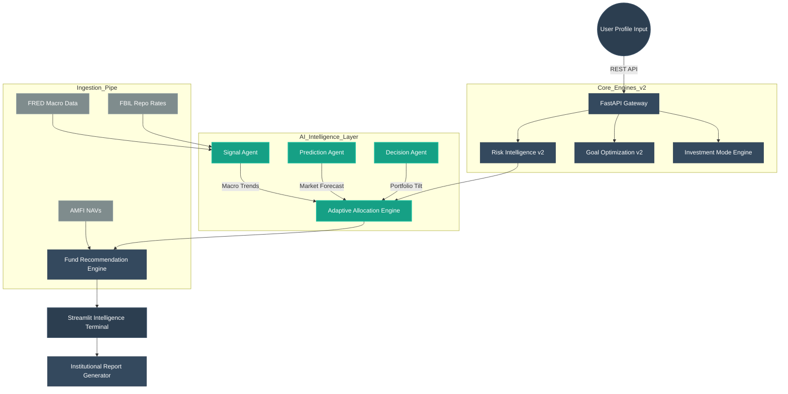
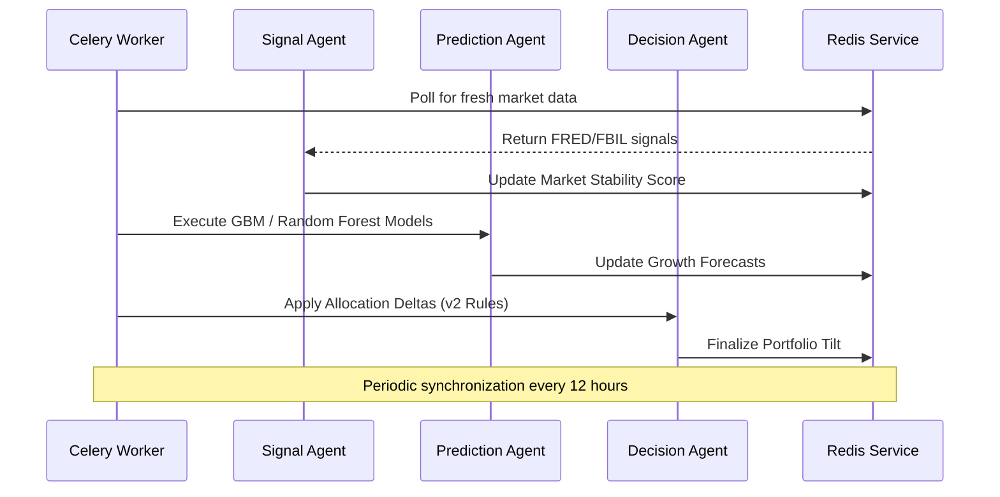

# AI-Powered Mutual Fund Advisory & Portfolio Intelligence System

An institutional-grade, AI-driven financial planning and portfolio intelligence engine. This system integrates Modern Portfolio Theory (MPT), Monte Carlo simulations, and real-time macroeconomic signals to deliver personalized, goal-oriented investment strategies.

---

## Technical Overview

The system is designed as a distributed intelligence platform, utilizing a multi-layered architecture to process user profiles, market signals, and fund performance data. Version 2.0 introduces a centralized engine routing system, expanded financial goal types, and a market-aware investment deployment logic.

## System Architecture

### Distributed Intelligence Flow
The following diagram illustrates the data flow from user input to the final intelligence report, highlighting the interaction between the core engines and the asynchronous AI intelligence layer.


```mermaid
graph TD
    classDef user fill:#2c3e50,color:#fff,stroke:#34495e,stroke-width:2px
    classDef engine fill:#34495e,color:#fff,stroke:#2c3e50,stroke-width:1px
    classDef ai fill:#16a085,color:#fff,stroke:#1abc9c,stroke-width:2px
    classDef data fill:#7f8c8d,color:#fff,stroke:#95a5a6,stroke-width:1px

    User((User Profile Input)):::user --> |REST API| API[FastAPI Gateway]:::engine
    
    subgraph Core_Engines_v2
        API --> RiskEngine[Risk Intelligence v2]:::engine
        API --> GoalEngine[Goal Optimization v2]:::engine
        API --> ModeEngine[Investment Mode Engine]:::engine
    end

    subgraph AI_Intelligence_Layer
        direction TB
        SignalAgent[Signal Agent]:::ai --> |Macro Trends| AdaptiveAlloc[Adaptive Allocation Engine]:::ai
        PredictionAgent[Prediction Agent]:::ai --> |Market Forecast| AdaptiveAlloc
        DecisionAgent[Decision Agent]:::ai --> |Portfolio Tilt| AdaptiveAlloc
    end

    RiskEngine --> AdaptiveAlloc
    AdaptiveAlloc --> RecoEngine[Fund Recommendation Engine]:::engine
    
    subgraph Ingestion_Pipe
        AMFI[AMFI NAVs]:::data --> RecoEngine
        FRED[FRED Macro Data]:::data --> SignalAgent
        FBIL[FBIL Repo Rates]:::data --> SignalAgent
    end

    RecoEngine --> Terminal[Streamlit Intelligence Terminal]:::user
    Terminal --> PDF[Institutional Report Generator]:::engine
```

### Async Agent Orchestration
AI agents operate in a decoupled environment via Celery workers, ensuring high availability and market responsiveness.


```mermaid
sequenceDiagram
    participant W as Celery Worker
    participant S as Signal Agent
    participant P as Prediction Agent
    participant D as Decision Agent
    participant Cache as Redis Service

    W ->> Cache: Poll for fresh market data
    Cache -->> S: Return FRED/FBIL signals
    S ->> Cache: Update Market Stability Score
    W ->> P: Execute GBM / Random Forest Models
    P ->> Cache: Update Growth Forecasts
    W ->> D: Apply Allocation Deltas (v2 Rules)
    D ->> Cache: Finalize Portfolio Tilt
    Note over W,Cache: Periodic synchronization every 12 hours
```

---

## Core Intelligence Modules

### 1. Risk Intelligence Engine (v2.0)
The Risk Engine performs multi-factor profiling to quantify a user's risk tolerance.
- **Factor Analysis**: Evaluates age-based risk capacity, dependency ratios, and behavioral traits.
- **XAI (Explainable AI)**: Provides a granular breakdown of score contributions, ensuring transparency in the advisory process.
- **Behavioral Normalization**: Maps qualitative inputs to quantitative risk vectors (0.0 - 10.0).

### 2. Goal Optimization Engine (v2.0)
A comprehensive planning module supporting lifecycle-specific financial targets.
- **Expanded Goal Types**: Includes Retirement, Child Education, Marriage, Real Estate Purchase, and Emergency Funds.
- **Sustainability Planning**: Retirement modual includes post-retirement income planning via annuity corpus and withdrawal rate calculations.
- **SIP Step-Up Logic**: Recommends incremental investment increases (top-ups) to align with long-term inflation-adjusted targets.

### 3. Investment Mode Engine (v2.0)
A market-aware module that recommends the optimal deployment strategy based on current stability scores and valuation metrics.
- **Deployment Strategies**: Recommends SIP, Lumpsum, STP (Systematic Transfer Plan), or SWP (Systematic Withdrawal Plan).
- **Valuation Guardrails**: Analyzes Nifty P/E and VIX levels to prevent aggressive deployment during market peaks.

### 4. Adaptive Allocation Layer
Adjusts model portfolio weights based on live macroeconomic signals (Inflation, Repo Rate, Bond Yields).
- **Macro-Aware Rebalancing**: Tilts asset weights between Equity, Debt, and Gold to mitigate systemic risk.
- **Feature-Flag Control**: Engine routing is handled via `config.py`, allowing for seamless switching between v1 logic and advanced v2 modules.

---

## Mathematical Foundations

- **Modern Portfolio Theory (MPT)**: Baseline asset allocation optimized for the efficient frontier relative to the user's risk profile.
- **Monte Carlo Simulations**: Executes 1,000+ iterations to determine the "Probability of Success" for financial goals.
- **Geometric Brownian Motion (GBM)**: Utilized by prediction agents to forecast potential market trajectories and asset class performance.
- **Inflation Indexing**: Continuous adjustment of goal targets using the latest Consumer Price Index (CPI) data.

---

## Technical Stack

- **Backend**: FastAPI (Asynchronous Gateway), Celery (Distributed Processing)
- **Frontend**: Streamlit (Reactive Intelligence Terminal), Plotly (Interactive Analytics)
- **Data Layer**: Redis (Agent State Management), PostgreSQL/JSON (Persistent Storage)
- **Quantitative Libraries**: Pandas, NumPy, Scikit-learn, SciPy, yfinance
- **Reporting**: WeasyPrint (Institutional PDF Generation)

---

## Installation and Configuration

### Prerequisites
- Python 3.10 or higher
- Redis Service (for Celery and Caching)

### Setup
1. **Repository Setup**:
   ```bash
   git clone <repository-url>
   cd mutual-fund-advisory
   python -m venv .venv
   source .venv/bin/activate
   pip install -r requirements.txt
   ```

2. **Configuration**:
   Modify `config.py` to enable v2 feature flags:
   ```python
   FEATURE_FLAGS = {
       "v2_risk_explanation": True,
       "advanced_goal_types": True,
       "investment_mode_recommendation": True,
       "advanced_products": False
   }
   ```

3. **Service Execution**:
   - **Backend**: `uvicorn backend.main:app --reload`
   - **Worker**: `celery -A ai_agents.tasks worker --loglevel=info`
   - **Frontend**: `streamlit run frontend/app.py`

---

## Repository Structure

```text
├── ai_agents/          # Celery workers and multi-agent orchestration
├── ai_layer/           # Signal processing and adaptive allocation logic
├── backend/            
│   ├── engines/        # Mathematical engines (v1/v2 versioned structure)
│   ├── api/            # REST endpoints and controllers
│   └── models/         # Pydantic core data schemas
├── frontend/           # Streamlit application and UI component library
├── data/               # Persistent storage and market caches
└── tests/              # Institutional-grade test suite
```

---


